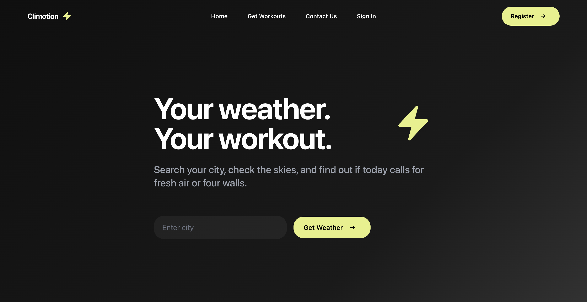

# Climotion Frontend

React frontend for Climotion. A weather-aware workout planner. Search by city to get current conditions and an indoor/outdoor workout recommendation. Live and actively being developed - new features in progress.

**🔗 Live app:** [climotion-frontend.onrender.com](https://climotion-frontend.onrender.com)
**Backend repo:** [climotion](https://github.com/kjicodes/climotion)

---

## Tech Stack

- React
- Tailwind CSS
- Headless UI

---

## Features

- City-based weather search with current conditions, temperature, and daily high/low
- Indoor/outdoor workout recommendation based on live weather data
- Dynamic gradient backgrounds that shift with weather condition
- Responsive layout for mobile and desktop
