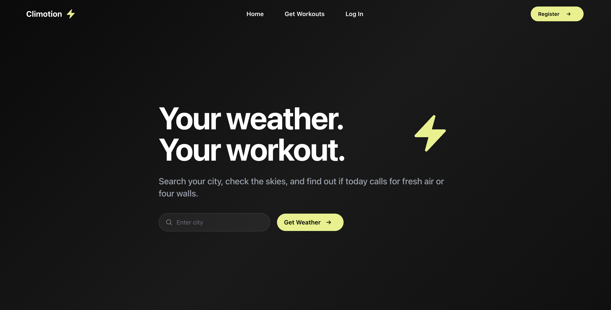
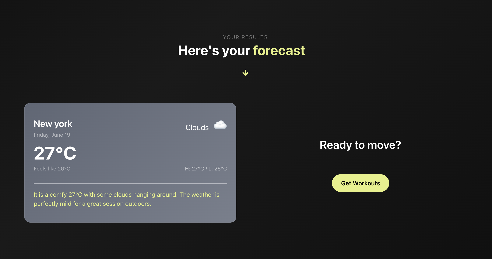
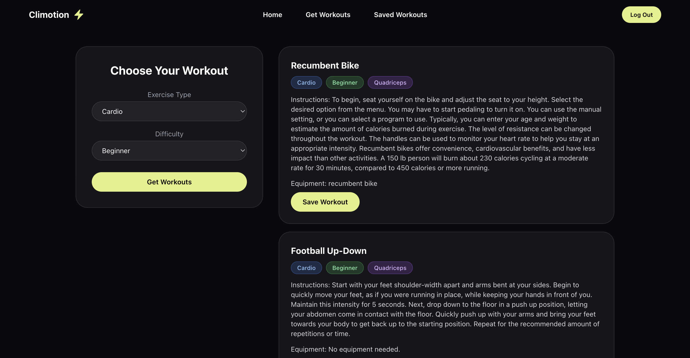
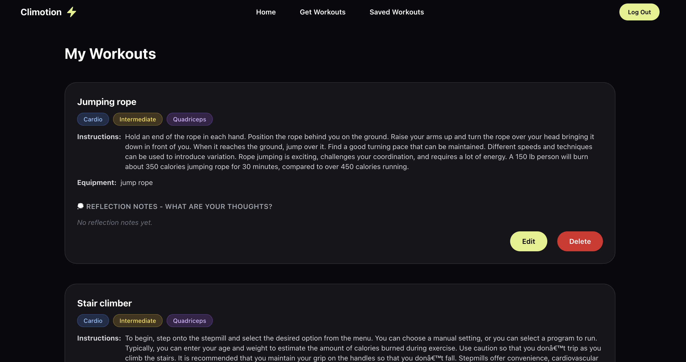
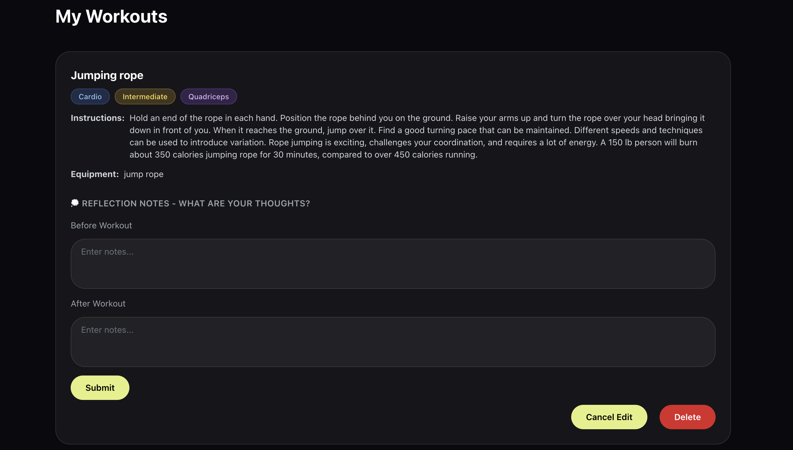
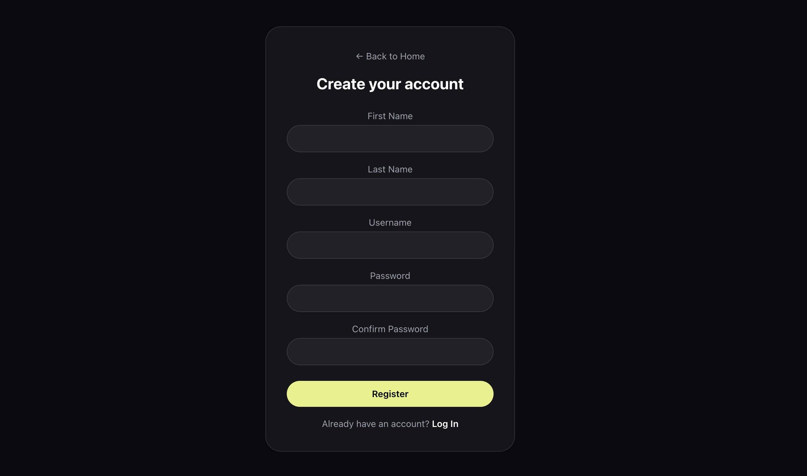
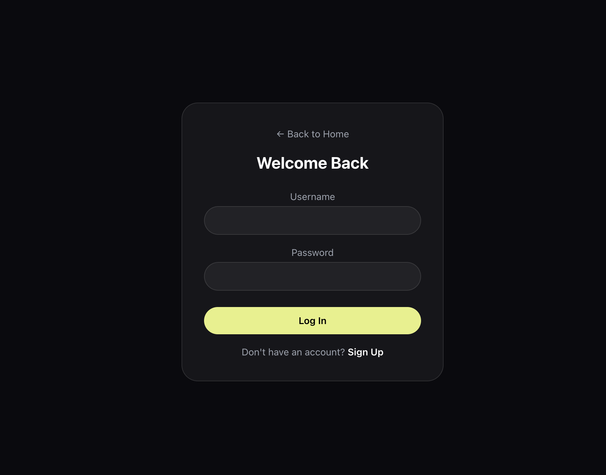

# Climotion Frontend

React frontend for Climotion. A weather-aware workout planner. Search by city to get current conditions and an indoor/outdoor workout recommendation. Live and actively being developed - new features in progress.

**🔗 Live app:** [climotion-frontend.onrender.com](https://climotion-frontend.onrender.com) <br>
**Backend repo:** [climotion](https://github.com/kjicodes/climotion)

## Tech Stack

- **Framework:** React, React Router
- **Styling & UI:** Tailwind CSS, Headless UI
- **Icons:** React Icons, Heroicons

## Features

- City search with popular city autocomplete suggestions
- Weather results displaying temperature, condition, feels like, and daily high/low
- AI-powered indoor/outdoor workout recommendation based on current weather
- Browse and filter exercises by type, difficulty, and muscle group
- Save workouts with before/after reflection notes, with full edit and delete support
- User registration and login with persisted sessions via secure httpOnly JWT cookies
- Dynamic background gradients that change per weather condition
- Responsive layout for mobile and desktop

## Running Locally

1. Clone and run the backend first, following its own README: [climotion](https://github.com/kjicodes/climotion)

2. Create a `.env` file in this project's root:

    `REACT_APP_API_URL=http://localhost:8000`

    pointed at wherever your local backend is actually running.

3. Install dependencies and start the dev server:

    ```bash
    npm install
    npm start
    ```

## Project Structure

    ```
    src/
    ├── api/              # Functions for calling the Django REST backend
    ├── components/       # Reusable UI pieces, one folder per component (.jsx + .css)
    ├── context/          # React Context providers (AuthContext for auth state)
    ├── pages/            # Top-level route components (Home, Login, Register, Workouts, SavedWorkouts)
    ├── App.js            # Route definitions
    └── index.js          # App entry point
    ```

## Roadmap

- [ ] UI for uploading workout-goal documents and viewing the generated AI workout plan
- [ ] "Export to Google Sheets" action on generated workout plans
- [ ] "Sign in with Google" button and OAuth flow
- [ ] Add Docker support for local frontend setup

## Screenshots
















